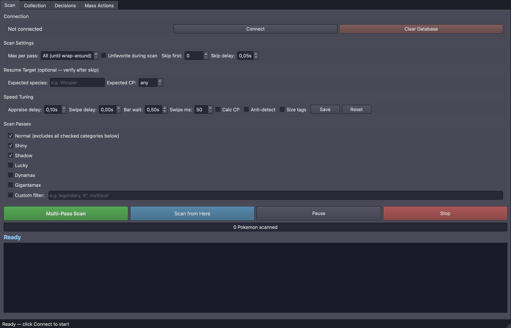
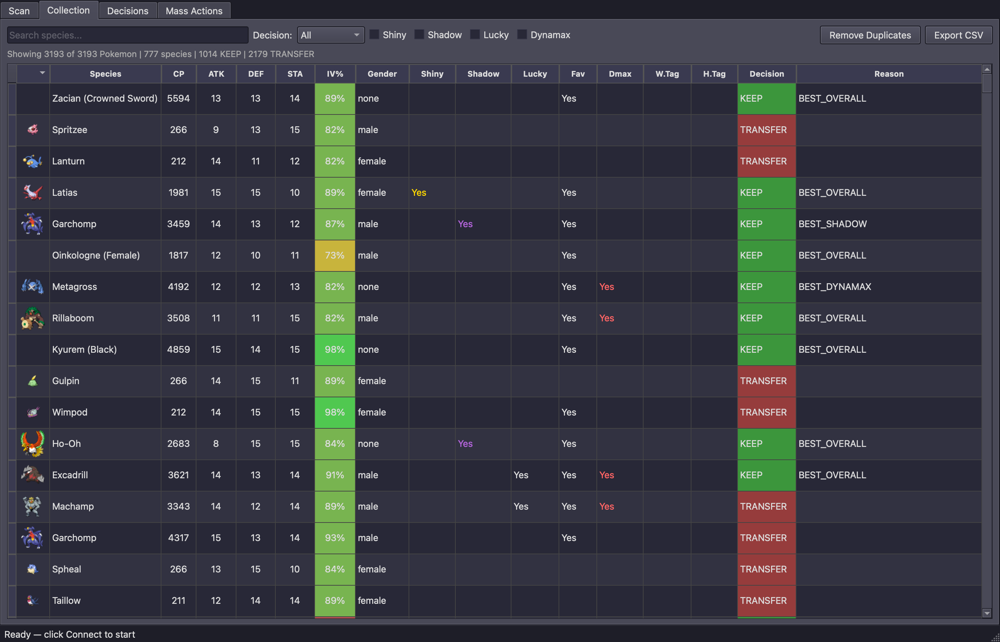
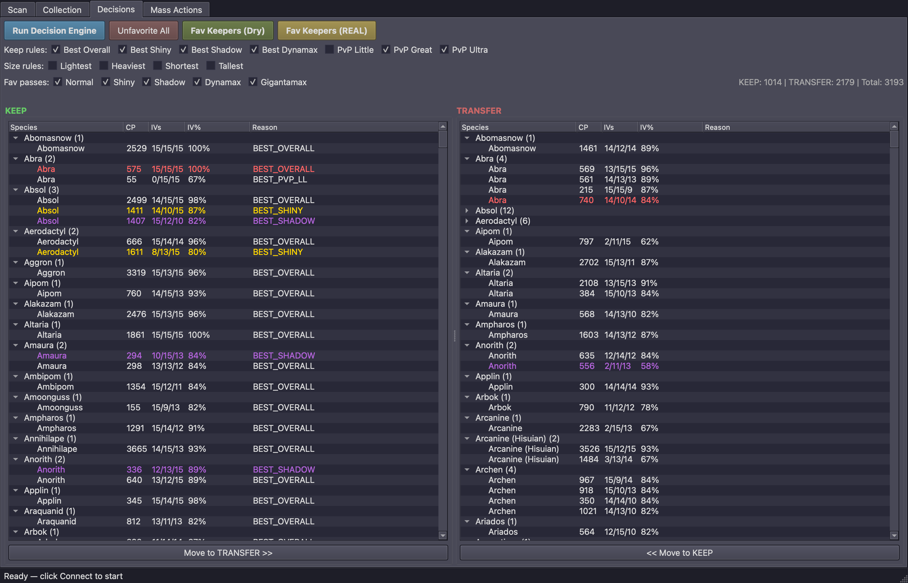
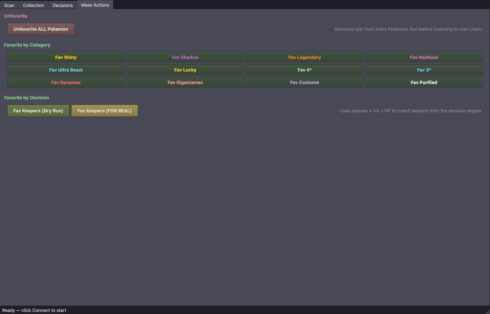
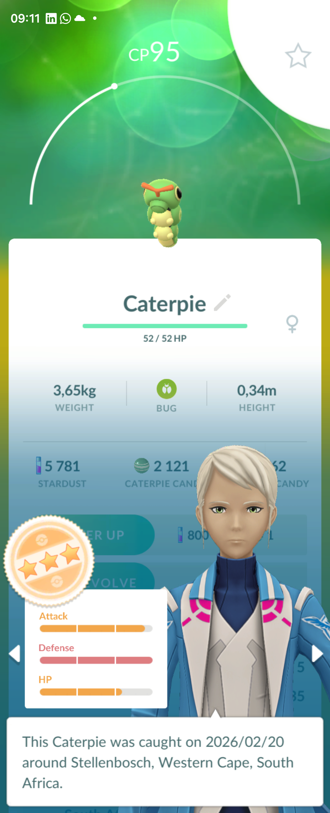

# Pokemon Go Storage Manager

A desktop application that connects to an Android phone via ADB, scans your entire Pokemon Go storage using screen capture + OCR, builds a local database of every Pokemon with full IV stats, applies intelligent keep/transfer rules, and favorites the keepers — so you can safely mass-transfer everything else in-game.

No modification to Pokemon Go is involved. The tool interacts with the phone exactly as a human would — via screen captures and simulated taps.

## Screenshots

### Desktop GUI

**Scan Tab** — Configure multi-pass scanning with speed tuning, scan passes (Normal, Shiny, Shadow, Dynamax, etc.), and resume support.



**Collection Browser** — Browse all 3,000+ scanned Pokemon with species sprites, IV percentages, shiny/shadow/lucky badges, and KEEP/TRANSFER decisions color-coded.



**Decision Review** — Side-by-side KEEP vs TRANSFER lists grouped by species. Move Pokemon between lists before approving. Shinies highlighted in gold, shadows in purple.



**Mass Actions** — One-click favorite by category (Shiny, Shadow, Legendary, 4-star, etc.) or favorite all keepers from the decision engine.



### Phone (Samsung Galaxy Z Fold6)

**Appraisal Screen** — The tool reads CP, species name, HP, IV bars (Attack/Defense/HP), and status icons directly from the in-game appraisal overlay.



## How It Works

```
┌──────────────┐       ADB (USB)              ┌──────────────┐
│   Desktop    │ ◄──────────────────────────► │ Android Phone│
│   (Python)   │   screencap + input tap      │ (Pokemon Go) │
│              │                               └──────────────┘
│  ┌─────────┐ │
│  │ADB Ctrl │ │  Screen capture + tap/swipe dispatch
│  ├─────────┤ │
│  │Screen   │ │  OCR (Tesseract + PaddleOCR) + pixel analysis (OpenCV)
│  │Reader   │ │
│  ├─────────┤ │
│  │Indexing │ │  State machine: appraise → read → swipe → repeat
│  │Engine   │ │
│  ├─────────┤ │
│  │SQLite   │ │  Local database, one row per Pokemon
│  │Database │ │
│  ├─────────┤ │
│  │Decision │ │  Rules engine + PvP IV rankings
│  │Engine   │ │
│  ├─────────┤ │
│  │Executor │ │  Favorites keepers by matching species + IVs + HP
│  └─────────┘ │
└──────────────┘
```

### Scanning Pipeline

1. **Connect** your phone via USB and launch Pokemon Go
2. **Multi-pass scan** uses Pokemon Go's built-in search filters (`!shiny&!shadow`, `shiny`, `shadow`, `dynamax`, etc.) to categorize Pokemon automatically
3. For each Pokemon, the tool opens the appraisal overlay and reads:
   - **Species name** — OCR from the "caught" bubble text
   - **CP** — OCR from the detail screen header
   - **IV bars** — Pixel analysis of the ATK/DEF/STA bar fill levels (0–15 each)
   - **HP** — OCR from the HP text
   - **Icons** — Pixel detection for favorite star, lucky background, gender
4. **Exact validation** — Complete species/form, HP and IV evidence is checked against the CP formula. A uniquely calculated CP is independently confirmed. Ambiguous cases use CP OCR, then optional bounded rotation/tap and canceled-preview recovery. Candy text constrains the evolution family; it does not replace the caught species with the base Pokemon.
5. **SQLite** stores one row per verified scan-session position. Same-stat adjacent Pokemon stay separate; a new scan session is not automatically merged with previous sessions.

### Decision Engine

The decision engine applies rules per species group (in priority order):

| Rule | What it keeps |
|------|--------------|
| `BEST_OVERALL` | Highest IV total, then highest CP |
| `KEEP_PERFECT_IV` | Every exact 15/15/15 specimen, including duplicates; enabled by default |
| `BEST_CP` | Highest current CP per stored species/form, alongside other keepers; enabled by default |
| `BEST_SHINY` | Best shiny specimen per species |
| `BEST_SHADOW` | Best shadow specimen per species |
| `BEST_DYNAMAX` | Best Dynamax/Gigantamax per species |
| `BEST_PVP_LL` | Best Little League PvP candidate |
| `BEST_PVP_GL` | Best Great League PvP candidate |
| `BEST_PVP_UL` | Best Ultra League PvP candidate |
| `BEST_LIGHTEST` / `HEAVIEST` / `SHORTEST` / `TALLEST` | Size record holders |
| Safety | Never transfer the last of any species |

Everything else is marked `TRANSFER` as a suggestion for review. PvP uses exact
stored forms and excludes specimens already above the league CP cap. Its cached
IV rankings still need rebuilding/versioning after calculation changes, and
evolution potential, moves, teams and broader collection preferences are not
evaluated. Existing favorite stars are not automatic KEEP rules, and rerunning
the engine replaces manual decisions. Do not interpret the list as proof that
every suggested transfer is unnecessary.

### Execution

**Review PvP cleanup…** in Decisions or Mass Actions lists recorded favorites
marked `TRANSFER` with 0–2★ appraisal. Every `KEEP` and every 3–4★ Pokémon is
protected. Uncheck personal exceptions, then choose **Dry run selected** or
**Unfavorite selected**. Matching Pokémon are selected together; unchecking one
protects the entire group. Cleanup can remove all matching stars when every
member is reviewed as unwanted and the complete live group is verified.
Incomplete, conflicting or unverified groups stay favorited. Confirmed results
are saved for the whole group without assigning changes to arbitrary duplicates.
It verifies a filtered group first, then swipes through that group to unfavorite
the selected matches. Dry run only verifies. Leave the device alone during a run.
Use the scanned account and device. Cleanup follows your saved decisions and
does not reassess evolution potential or moves. Manual KEEP/TRANSFER changes
are saved before either list refreshes; rerunning the engine replaces them.

After reviewing decisions in the GUI, the executor:
1. Narrows each keeper pass to pending CP values and excludes existing favorites with `!favorite`, then verifies the complete in-game search filter.
2. Reads stable appraisal evidence through the shared scanner.
3. Matches exact species/form, CP, HP, IVs and category flags against keeper occurrences.
4. Checks identity and the observed star, toggles once when needed, and verifies the result.
5. Refreshes the remaining results after changes, verifying that the count decreased by exactly the confirmed favorites. Confirmed gym defenders with hidden HP are skipped without changing their stars.
6. Reports unmatched, ambiguous, stopped and failed results for review. It never transfers Pokemon.

Both Decisions and Mass Actions show the selected keeper pass (for example,
`Pass 1/5: Normal`), the categories still to come, and cumulative keeper counts.
The progress bar describes only the current CP batch and refresh round. Its
count can restart as confirmed favorites leave the results; the overall tally
continues across those rounds. Pending targets and records needing review stay
visible at completion. Dry runs label matches as “would favorite.”

## Features

- **Multi-pass scanning** with configurable search filters (Normal, Shiny, Shadow, Lucky, Dynamax, Gigantamax, Custom)
- **Shared frame OCR** — native macOS Vision on the app stream, with Tesseract and optional PaddleOCR paths
- **Consistent app layout** — app streams use 968 × 2376 at 420 DPI on phones and tablets; matching coordinates can be reused while device verification stays separate
- **App-only stream** — a local scrcpy client exports a bounded 30-frame buffer; UI controls turn the physical phone screen on or off
- **Process monitoring** — CPU and RSS for the manager and verified helpers; GPU usage is labeled not measured, independently of whether GPU acceleration is active
- **Fingerprint validation** — Every Pokemon verified against the CP formula before storing
- **PvP IV rankings** — Computed from PvPoke gamemaster.json for all leagues
- **Desktop GUI** (PySide6/Qt) with dark theme, live scan progress, collection browser with sorting/filtering, decision review with drag-and-drop
- **Resume support** — Fast-swipe past already-scanned Pokemon with target verification
- **Anti-detection** — Randomized delays, tap jitter, configurable micro-breaks
- **Unresolved captures** — verified favorite-for-review fallback; lost identity stops instead of toggling blindly
- **Battery monitoring** — Auto-pause when battery drops below 20%
- **CSV export** for spreadsheet review
- **Dry run mode** — Test the favorite pass without actually tapping stars

## Requirements

- **Python 3.11+** (tested on 3.13)
- **Android phone** connected via USB with ADB debugging enabled
- **Pokemon Go** installed on the phone
- **Tesseract OCR** installed on the host machine
- **ADB** (Android Debug Bridge) installed

### System Dependencies

```bash
# macOS
brew install tesseract
brew install android-platform-tools

# Ubuntu/Debian
sudo apt install tesseract-ocr
sudo apt install adb
```

### Python Dependencies

```bash
python -m venv .venv
source .venv/bin/activate
pip install -r requirements.txt
```

Optional (for improved OCR accuracy):
```bash
pip install paddleocr paddlepaddle
```

## Usage

### GUI (Recommended)

```bash
python run.py gui
```

For the macOS app stream and dark-phone controls, use:

```bash
scripts/macos_launcher.zsh
```

See the [phone scan runbook](docs/runbooks/phone-scan.md) for scrcpy, native
helper build prerequisites, calibration, supported Android setup, and recovery.

1. Click **Connect** to establish ADB connection
2. Configure scan passes (Normal, Shiny, Shadow, etc.)
3. Adjust speed settings if needed
4. Open Pokemon Go on your phone, navigate to storage, tap any Pokemon, open its appraisal
5. Click **Multi-Pass Scan** or **Scan from Here**
6. After scanning, go to the **Decisions** tab and click **Run Decision Engine**
7. Review KEEP/TRANSFER lists, adjust as needed
8. Click **Fav Keepers (Dry)** to test, then **Fav Keepers (REAL)** to execute
9. Review unresolved matches and keeper suggestions before making any manual transfer decisions in Pokemon Go

### CLI

```bash
# Test ADB connection
python run.py test-adb

# Calibrate for your device
python run.py calibrate

# Test screen reading
python run.py test-read --appraise

# Run indexing (must be on appraisal screen)
python run.py index --total 3000 --export pokemon.csv

# Run decision engine
python run.py decide --export decisions.csv
```

## Project Structure

```
pokemgr/
├── adb/
│   ├── controller.py      # ADB connection, screencap, tap, swipe
│   └── navigator.py       # In-game navigation (storage, search, appraisal)
├── calibration/
│   ├── profile.py          # Device-specific screen region calibration
│   └── regions.py          # Screen region definitions (CP, name, bars, etc.)
├── reader/
│   ├── screen.py           # ScreenReader facade
│   ├── ocr.py              # Tesseract OCR for text (CP, name, HP)
│   ├── ocr_engine.py       # PaddleOCR engine (accurate fallback)
│   ├── bars.py             # IV bar pixel analysis (ATK/DEF/STA 0-15)
│   ├── icons.py            # Icon detection (favorite, lucky, shiny)
│   └── gender.py           # Gender symbol detection
├── indexer/
│   ├── state_machine.py    # Read → swipe → read → swipe loop
│   └── multi_pass.py       # Multi-pass scan with search filters
├── data/
│   ├── database.py         # SQLite storage with dedup and sessions
│   └── models.py           # Pokemon dataclass
├── decision/
│   ├── engine.py           # Keep/transfer rule engine
│   ├── rules.py            # Individual decision rules
│   └── safety.py           # Safety checks (last of species, etc.)
├── pvp/
│   ├── calculator.py       # PvP IV ranking computation (4096 combos)
│   ├── fingerprint.py      # Species identification from IVs + HP
│   ├── cp_validator.py     # CP formula validation
│   └── rankings_db.py      # PvP rankings SQLite database
├── execution/
│   └── executor.py         # Favorite keepers via ADB
├── gui/
│   ├── app.py              # Qt application entry point
│   ├── main_window.py      # Main window with tabbed interface
│   ├── workers.py          # Background threads for scan/favorite
│   └── widgets/
│       ├── scan_control.py        # Scan configuration and progress
│       ├── collection_browser.py  # Pokemon table with sorting/filtering
│       ├── decision_review.py     # KEEP/TRANSFER review panels
│       └── mass_actions.py        # Batch favorite operations
├── sprites.py              # Pokemon sprite loading
└── config.py               # Global settings, delays, paths
```

## Device Support

Currently tested on:
- **Samsung Galaxy Z Fold6** (SM-F956B) — cover screen 968x2376

The calibration system automatically creates device-specific profiles based on model + resolution. Other Android devices should work after calibration, though the default screen regions are tuned for the Fold6 cover screen.

## Performance

A bounded 10-Pokemon M4 Pro/Fold6 stream sample completed in 22.565 seconds
(about 26.6/min including startup). Obscured CP recovery can take much longer;
this is not a whole-storage throughput guarantee. Optional timing spans report
capture, OCR, validation and navigation costs; see the runbook.

## Tests

```bash
pip install -r requirements-dev.txt
QT_QPA_PLATFORM=offscreen python -m pytest -q tests
python scripts/scrcpy_frame_sink/test_native.py
```

The pytest command includes both unittest classes and standalone pytest tests.
Private live-capture regressions skip when their local files are absent. To run
optional JPEG/profile regressions, set `POKEMGR_TEST_PROFILE` to your local
calibration JSON. Native frame-buffer tests require the project-local build;
the C bridge command also requires the documented macOS native dependencies.

## Safety

The tool is designed with multiple safety layers:

1. **Fingerprint validation** — Every Pokemon's stats are verified against the CP formula before storing
2. **Verified recovery** — Unresolved CP can trigger favorite-for-review only while identity and the star state remain verifiable; lost identity stops the operation
3. **Review before execute** — The decision engine output is always reviewed in the GUI before any favorites are applied
4. **Dry run mode** — Test the favorite pass without actually tapping stars
5. **Visible action results** — Unmatched, ambiguous and interrupted favorite actions remain visible for review
6. **Never auto-transfer** — The tool offers favorite/unfavorite actions; transfer decisions and any transfers remain with the user

## License

MIT
